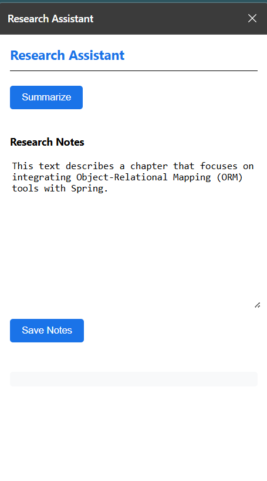

# 🧠 Smart Research Assistant - Chrome Extension

A lightweight and user-friendly **Chrome Extension** that summarizes online articles and web content. Built using **HTML**, **CSS**, **JavaScript**, and a ** Manifest file**, this extension improves productivity for students, researchers, and readers by providing quick summaries at the click of a button.

---

## 🌟 Features

- 🔍 One-click summarization of selected content or full pages  
- ⚡ Fast and efficient UI with minimal distractions  
- 🌐 Works across multiple websites and article types  
- 🧠 Lightweight and privacy-focused  
- 🖼️ Includes a extension icon

---

## 🛠️ Tech Stack

- **HTML** – For popup layout and structure  
- **CSS** – Styling and responsive popup design  
- **JavaScript** – DOM manipulation, content fetching, summarization logic  
- **manifest.json** – Chrome extension configuration  
- **PNG Icon** – Represents the extension in Chrome toolbar  

---

## 🚀 How to Use

### 1. Clone the Repository
```bash
git clone https://github.com/Jasleen-Kaur-123/smart-research-assistant.git
````

## 📸 Screenshots

### SRA ExtOne


### SRA ExtTwo



